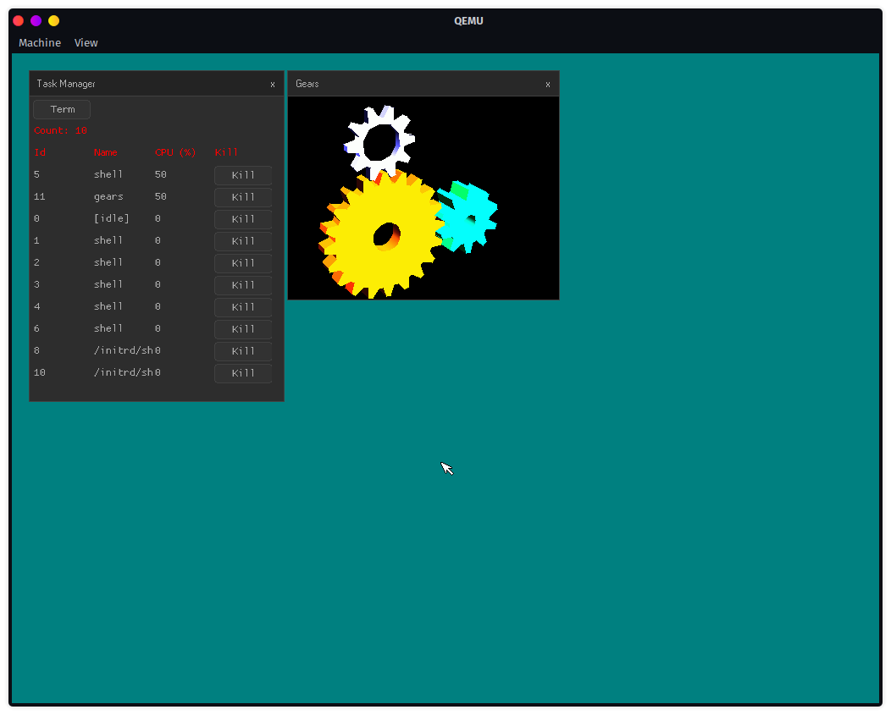

## About
Asterisk is an operating system written in C ~~(more of a kernel right now)~~. It uses some code from the discontinued project [soso](https://github.com/ozkl/soso), and currently only supports `i386+` processors.
Currently, asterisk is heavily developed, and being documented at the same time. Don't expect it to even run a shell. It only runs a program that prints out `Hello, world!`...
For now, our goal is to get command-line arguments working, as well as commenting and documenting the code as much as possible.
## Building
Read [BUILDING.md](docs/BUILDING.md) for learning how to build Asterisk.
## Testing
After building the kernel and making the CD-ROM image, you can test Asterisk:
```
make test
```
## Screenshot

*Asterisk running with [soso](https://github.com/ozkl/soso)'s initrd!*
## Contributors
When I took code from [soso](https://github.com/ozkl/soso), I also took some code from the pull requests that fixed different aspects of the kernel. Although they may not show up in the GitHub repository's contributor list, I will still add them here:
* [Dashbloxx](https://github.com/Dashbloxx) for creating this project
* [rilysh](https://github.com/rilysh) [for this](https://github.com/ozkl/soso/pull/10)
* [sk-io](https://github.com/sk-io) [for this](https://github.com/ozkl/soso/pull/9)
## License
Asterisk is licensed under the BSD-2-Clause license.
